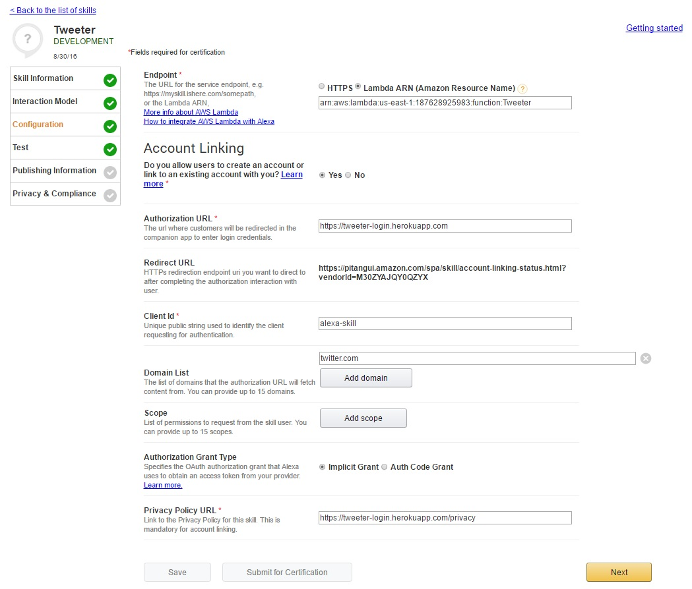

# Tweeter Login Portal

This repository provides a barebones web portal to provide an Amazon Alexa skill with access to your Twitter account. Some assembly necessary.

I run this on heroku, though you could theoretically run it anywhere. Spin up a free dyno and set config vars name CONSUMER_KEY and CONSUMER_SECRET with your respective keys for your [twitter app](https://apps.twitter.com/).

Then, modify the following code in the script tag in the callback redirect page located in [html/callback/index.html](html/callback/index.html) to use the RedirectURL from your skill in Amazon's developer portal.
```javascript
var separator = '%20';
var redirectURL = 'https://pitangui.amazon.com/spa/skill/account-linking-status.html?vendorId=M30ZYAJQY0QZYX';
$.get('https://tweeter-login.herokuapp.com/access-token' + location.search).done(function(data) {
  window.location.href = redirectURL + '#state=' + data.state + '&access_token=' + data.token + separator + data.secret + '&token_type=Bearer';
})
```
The api key and secret will be passed back to amazon as a single string separated by a percent encoded space(%20). You can modify this behavior by changing the separator value in the above code.

Your configs in the developer portal should look something like this, substituting your URLs for mine:

